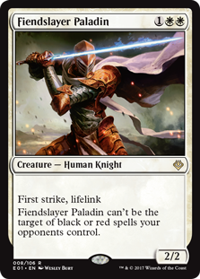
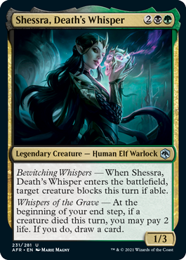
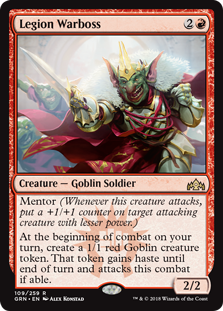

# Croupier: A Magic the Gathering dataset curator 

---
<p align="center">


 
</p>
---

Croupier is a python project for building creatures' dataset from the [Gatherer](https://gatherer.wizards.com/Pages/Default.aspx)
website, the official Magic Card Database. You could download the images and information from the type of creatures you 
want. The project's reason is to make available fun datasets for building toy machine learning projects.

##   What project includes?

* `card_metadata.py`: Retrieve a card type and populate the file `card_database.csv` with the following information:
  * id: card id used by The Gatherer database
  * type: card type (e.g. creature)
  * subtype: card subtype (e.g. elf, goblin, etc)
  * url: of the card page in The Gatherer
<br></br>
* `card_retriever.py`: Given a card url retrieve the whole card information into two sources:
  * A csv storing the card information such as description, abilities, mana cost, etc.
  * An image of the card
<br></br>
* `./sample_data`: A folder that includes a mini-dataset curated to exemplify the format of the files.
  * `card_database.csv`: metadata (`card_id`, `URL`) from various card's creatures types
  * `card_information.csv`: features with the text that have each card
  * `img/card_subtype`: each folder contain the card images (e.g. `img/goblin/`)

---

##  How to use it?

You can curate your specific database **via command line interface**. In a nutshell, it
is a two-step process:
1. Use `card_metadata.py` to create your `card_database.csv` populating the file with all card creatures' meta-information (`card_id`, `URL`) that belonged to the same kind.
2. Use `card_retriever.py` to extract the atomic information for each card of a given kind.

Let's start creating the `card_database.csv` with each Elf cards using the
command line:

```bash
python card_metadata.py Elf
```

If we want to add another creature type, we use the command line again, and the program will append the new metadata in
the file. **The important is that you have the metadata from the cards you want to retrieve the information before 
moving to the next step.** By the way, you should see something like the below video during the program execution.

<a href="https://asciinema.org/a/61IEummfN9kUU5bT7wibGgd2w?autoplay=1&speed=1.5" target="_blank"></a>

Let's move to the second step; if you want to get all cards' features and images from elf creatures, `card_retriever.py`
requires only the `creature_type` argument, via the command line looks as follows:

```bash
python card_retriever.py Elf
```

It's recommendable to check if all paths specified in the `config.py` are correctly set,
so you can use the option `--number [int]` to indicate how many cards you want to download, and 
it's good to try with one of a sample:

```bash
python card_retriever.py -n 1 Elf
python card_retriever.py --number 1 Elf
```
<a href="https://asciinema.org/a/ilRkCidxlrj0s8cC2oaRvkB9a?autoplay=1&speed=1.5" target="_blank"></a>

You should verify the new lines on the file `sample_data/card_information.csv` and the card images on the folder 
`sample_data/img/elf/`. **Note:** You can change the directory path in the `gatherer_croupier/config.py` file.

The cards downloaded are randomly selected when `card_retrieve.py` uses the `-n` option, but if
you want to download a specific card like [_"Shessra, Death's Whisper"_](https://gatherer.wizards.com/Pages/Card/Details.aspx?multiverseid=527518),
you can provide their id using the `--card_id` option. **Note:** the Gatherer database gives the 
card id in the card's URL.

```bash
python card_retriver.py Elf --card_id 527518
```

<a href="https://asciinema.org/a/pjXNUxVJDdxjBiNjNIjkB1T9E?autoplay=1&speed=1.5" target="_blank"></a>

or get the [Fiendslayer Paladin](https://gatherer.wizards.com/Pages/Card/Details.aspx?multiverseid=430547) card using
the non-verbose option `-i` instead `--card_id`:

```bash
python card_retriver.py -i 430547 Knight
```

Notice that you always need to provide the creature type as an argument in the command line for three reasons:
1. Retrieving: it got the card's URL from the `card_database.csv` filtering by creature type.
2. Labelling: it saved the card images using the name structure `[card_id]_[creature_type].[image_extension]`.
3. Storing: it used the creature type to organize and save images under the directory `data/img/[creature_type]`.

---

##  Image processing

**TODO:** Using OpenCV for cropping and standardising the card images. There are various image sizes
and two image extension: `PNG` and `JPEG`.

---

##  Card features

The croupier also extracts the card features such as card name, mana cost, card text, and others via the command line 
`card_retrieve.py`. The following information is in the `card_information.csv` file.

| column              | description                                                                           |
|---------------------|---------------------------------------------------------------------------------------|
 | id                  | The Gatherer's id unique for each card (aka `card_id`).                               |
 | CARD_NAME           | The name of the card creature.                                                        |
| MANA_COST_SYMBOL    | Total mana cost for invocation detailed by the type of mana (e.g. 2-Red-Black).       |
| MANA_COST_CONVERTED | Total mana cost for invocation regardless the mana type.                              |
| TYPES               | The card type could be more complex than just "creature", for example, "Elf Knight".  |
 | CARD_TEXT           | The text that includes the card effects and abilities.                                |
| FLAVOR_TEXT         | The decorator text related to the card.                                               |
| POWER_TOUGHNESS     | The attack and defense points (e.g. 4/2) of the creature.                             |
| EXPANSION           | The expansion in which the card belongs.                                              |
| RARITY              | The card rarity (i.e. uncommon, common, rare).                                        |
| CARD_NUMBER         | The number of the card in the expansion set.                                          |
| ARTIST              | The artist who creates the card image.                                                |
| COMMUNITY_RATING    | A five stars community rating,  there is an indicator of how many votes the card has. |

---

##  License

All card images, information, and symbols are trademarks of © [Wizards of the Coast](http://magicthegathering.com/). Thanks
to Andrew Gioia for creating the symbols in SVG format and make available in the [Keyrune](https://github.com/andrewgioia/keyrune) repository. Finally, the files
which not belong to both previous sources are under [MIT's license](LICENSE).

[](https://github.com/alcazar90/repo/blob/master/LICENSE)
